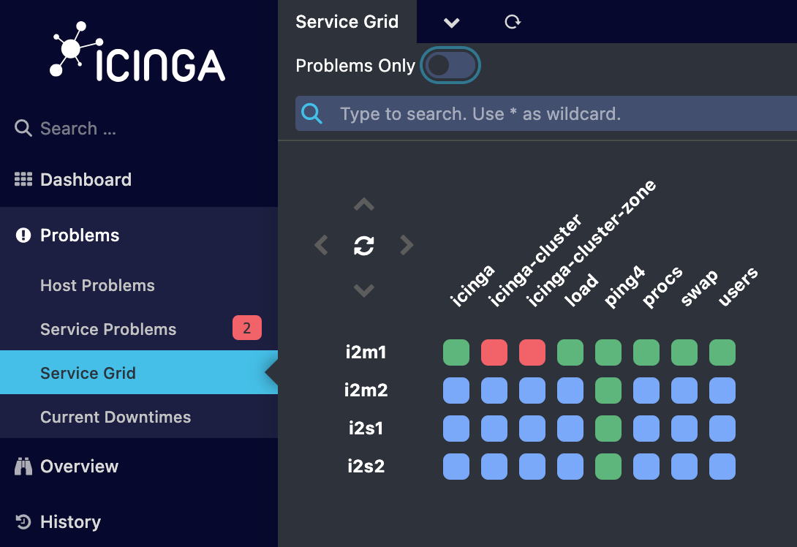

# icinga2-compose

This is a Docker Compose project to create a three level cluster with HA masters, satellites receiving config sync, and agents checked using command endpoint.

> This is a work in progress.  Currently 2 HA Masters and 2 Satellites

## Usage

```sh
cd icinga2-compose
docker compose up
```

### Quick Setup

This was created using Docker Desktop.  Connect to the _exec_ on each Icinga2 container and run `setup.sh`.  For Master 2, you will need to run it __twice__.  _Detailed steps below._

### Undo the Setup

```sh
docker compose down
docker compose up
```

### Icinga Web

Once the containers are running, you can connect to [Icinga Web 2](http://localhost:8080).

- __Username:__ `icingaadmin`
- __Password:__ `123456`

Best viewed as Service Grid (Problems Only = `false`)



## Detailed Setup Steps

### Setup Icinga 2 Master 1 (`i2m1`)

```sh
./setup.sh
```
    
- Copies the `ca` to a shared location, used by Icinga 2 Master 2 (i2m2)
- Replaces the `/etc/icinga2` _symlink_
    - __Container restart required!__
    

    
### Setup Icinga 2 Master 2 (`i2m2`)

```sh
./setup.sh
```

- Copies the `ca` from Master 1
- Removes contents of `/var/lib/icinga2/certs/` _forcing the regneration_ with the updated `ca`.
    - __Container restart required!__
    

```sh
./setup.sh
```

- Begins `icinga2 node wizard`

    We want to enable CSR Auto-Signing.  Tickets need to be generated on the master and copied to client setup wizards.

    - Specify `i2m2` as __`agent/satellite`__ _default `[Y/n]`_
    - Specify the parent endpoint __`i2m1`__
    - Connection to the parent? _default `[Y/n]`_
    - Master/Satellite endpoint host __`i2m1`__ _with default `port`_
    - Add more endpoints? _default [y/N]_ 
    - Parent certificate correct? `[y/N]: y` 
    - Connect to __`i2m1`__ and generate `ticket`
        - `icinga2 pki ticket --cn 'i2m2'`
    - Enter `ticket` generated by `i2m1`
    
    > __Enter default values beyond this point.__  _The settings will be adjusted._
    
    - Specify the API bind host/port 
        - _default `Bind Host []`_
        - _default `Bind Port []`_
    - Config from parent node? _default [y/N]_
    - Commands from parent node? _default [y/N]_ 
    - Local zone name _default [i2m2]_ 
    - Parent zone name _default [master]_ 
    - Additional global zones? _defaut [y/N]_ 
    - Inclusion of the conf.d directory _default [Y/n]_ 
- Replaces the `/etc/icinga2` _symlink_
    - __Container restart required!__        
    

### Setup Icinga 2 Satellite 1 (`i2s1`)
    
```sh
./setup.sh
```
- Begins `icinga2 node wizard`

    - Specify `i2s1` as __`agent/satellite`__ _default `[Y/n]`_
    - Specify the parent endpoint __`i2m1`__
    - Connection to the parent? _default `[Y/n]`_
    - Master/Satellite endpoint host __`i2m1`__ _with default `port`_
    - Add more endpoints? `[y/N]: y` 
    - Specify the parent endpoint __`i2m2`__
    - Connection to the parent? _default `[Y/n]`_
    - Master/Satellite endpoint host __`i2m2`__ _with default `port`_  
    - Parent certificate correct? `[y/N]: y` 
    - Connect to __`i2m1`__ and generate `ticket`
        - `icinga2 pki ticket --cn 'i2s1'`
    - Enter `ticket` generated by `i2m1`
    
    > __Enter default values beyond this point.__  _The settings will be adjusted._
    
    - Specify the API bind host/port 
        - _default `Bind Host []`_
        - _default `Bind Port []`_
    - Config from parent node? _default [y/N]_
    - Commands from parent node? _default [y/N]_ 
    - Local zone name _default [i2m2]_ 
    - Parent zone name _default [master]_ 
    - Additional global zones? _defaut [y/N]_ 
    - Inclusion of the conf.d directory _default [Y/n]_ 
- Replaces the `/etc/icinga2` _symlink_
    - __Container restart required!__    

### Setup Icinga 2 Satellite 2 (`i2s2`)
    
```sh
./setup.sh
```
- Begins `icinga2 node wizard`

    - Specify `i2s2` as __`agent/satellite`__ _default `[Y/n]`_
    - Specify the parent endpoint __`i2m1`__
    - Connection to the parent? _default `[Y/n]`_
    - Master/Satellite endpoint host __`i2m1`__ _with default `port`_
    - Add more endpoints? `[y/N]: y` 
    - Specify the parent endpoint __`i2m2`__
    - Connection to the parent? _default `[Y/n]`_
    - Master/Satellite endpoint host __`i2m2`__ _with default `port`_  
    - Parent certificate correct? `[y/N]: y` 
    - Connect to __`i2m1`__ and generate `ticket`
        - `icinga2 pki ticket --cn 'i2s2'`
    - Enter `ticket` generated by `i2m1`
    
    > __Enter default values beyond this point.__  _The settings will be adjusted._
    
    - Specify the API bind host/port 
        - _default `Bind Host []`_
        - _default `Bind Port []`_
    - Config from parent node? _default [y/N]_
    - Commands from parent node? _default [y/N]_ 
    - Local zone name _default [i2m2]_ 
    - Parent zone name _default [master]_ 
    - Additional global zones? _defaut [y/N]_ 
    - Inclusion of the conf.d directory _default [Y/n]_ 
- Replaces the `/etc/icinga2` _symlink_
    - __Container restart required!__    
      
